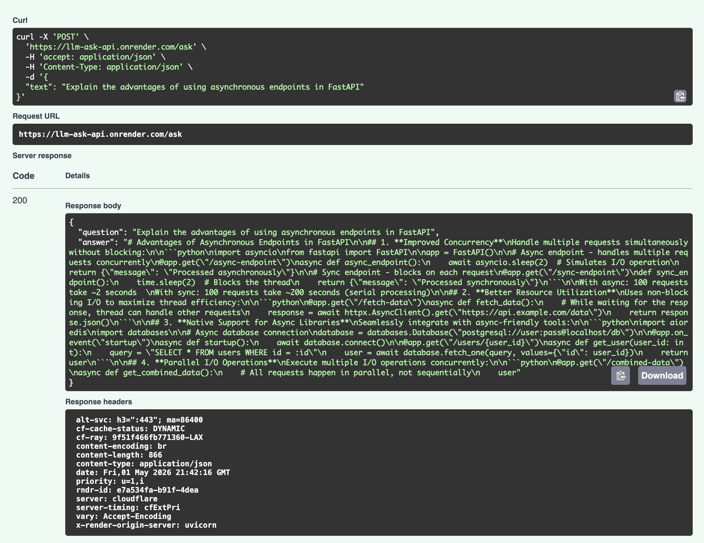

# LLM Ask API — Claude-Powered Question Answering Service

A production-ready REST API built with FastAPI that wraps Anthropic's Claude to answer natural language questions. Deployed on Render with environment variable security and structured JSON responses.



*FastAPI's auto-generated Swagger UI at `/docs` — test the API directly in the browser.*

---

## Live demo

Base URL: `https://llm-ask-api.onrender.com/`

> **Cold start:** Free tier sleeps after 15 min inactivity — first request takes 30–60 sec.

---

## What it does

- Wraps Claude (Anthropic) behind a clean REST API with GET and POST endpoints
- Returns structured JSON responses with the original question and generated answer
- Validates input, handles authentication errors, and returns standard HTTP status codes
- Deployable on any cloud platform (Render, Railway, Fly.io) via environment variables
- Interactive API docs auto-generated at `/docs` (Swagger UI)

---

## How it works

A client request flows through three layers before returning a response:

**Input validation:** FastAPI's Pydantic model validates the incoming request 
before any API call is made. For GET requests, an empty or missing `q` parameter 
returns a 400 immediately. For POST requests, the `Question` model enforces that 
`text` is a non-empty string. This prevents malformed requests from consuming 
Anthropic API tokens.

**Claude API call:** The validated question is passed to `client.messages.create()` 
using the Anthropic Python SDK. The service uses Claude Haiku 4.5 
(`claude-haiku-4-5-20251001`) for low-latency, cost-efficient responses. 
The API key is read from the environment at startup — never hardcoded.

**Response formatting:** Claude's response is extracted from 
`message.content[0].text` and returned as a structured JSON object containing 
both the original question and the generated answer. This makes responses 
predictable and easy to parse programmatically.

**Error handling:** Anthropic API errors (authentication failures, rate limits, 
timeouts) are caught and mapped to appropriate HTTP status codes so clients 
receive actionable error responses rather than generic 500s.

---

## Rate limiting

The API enforces a rate limit of **10 requests per minute per IP address** to prevent abuse and manage API costs. This limit applies to both GET and POST endpoints.

When the limit is exceeded, the server returns HTTP 429 (Too Many Requests). Clients should implement exponential backoff and retry after a short delay.

On Render's free tier, the rate limit is applied per client IP using the `X-Forwarded-For` header, so each user has an independent 10-request/minute budget.

---

## Implementation highlights

- Dual endpoint design (GET + POST) covers both browser-accessible and 
  programmatic use cases with a single service
- Pydantic model validation on POST requests catches malformed input before 
  it reaches the Claude API, reducing unnecessary API spend
- Environment variable API key management means the service is deployable 
  anywhere without code changes
- Standard HTTP status codes (400, 401, 429, 500) map to specific failure 
  modes so clients can handle errors programmatically
- FastAPI's automatic OpenAPI generation provides a zero-maintenance 
  interactive test UI at `/docs`

---

## Limitations

- Render free tier sleeps after 15 minutes of inactivity; first request 
  after idle takes 30–60 seconds
- No authentication layer — any caller with the URL can use the endpoint 
  (rate limited to 10 requests/minute per IP to prevent abuse)
- Stateless by design — each request is independent with no conversation history 
  (this is intentional for a simple Q&A API; multi-turn use cases should 
  use the Streamlit demo instead)
- No streaming — responses return only after Claude has finished generating 
  (latency scales with answer length)
- Rate limiting (10 requests/minute per IP) prevents abuse and manages API costs 
  without requiring authentication

---

## Quick start

No setup required to test the live API. Open this URL in any browser:

    https://llm-ask-api.onrender.com/ask?q=what+is+retrieval+augmented+generation

Or with curl:

    curl -X POST https://llm-ask-api.onrender.com/ask \
      -H "Content-Type: application/json" \
      -d '{"text": "what is fastapi"}'

For local development, see [Local setup](#local-setup) below.

---

## Requirements

- Python 3.13+
- Git
- An Anthropic API key ([get one here](https://console.anthropic.com))

Dependencies are listed in `requirements.txt`. See [Tech stack](#tech-stack) below.

---

## Local setup

**Clone and enter the project:**

    git clone https://github.com/digitalrower/llm-ask-api.git
    cd llm-ask-api


**Pin Python version (requires pyenv):**

    pyenv local 3.13.3
    python --version              # should show Python 3.13.3

**Create and activate a virtual environment:**

    python -m venv .venv
    source .venv/bin/activate     # Mac/Linux
    # Windows: .venv\Scripts\activate

**Install dependencies:**

    pip install -r requirements.txt

**Set up environment variables:**

    cp .env.example .env

Open `.env` and replace the placeholder with your actual Anthropic API key:

    ANTHROPIC_API_KEY=your_actual_api_key_here


---

## Run locally

    uvicorn src.main:app --reload

Server starts at `http://localhost:8000`

Interactive API docs available at `http://localhost:8000/docs`

---

## API reference

### GET /ask

Returns a Claude-generated answer to a question passed as a query parameter.

**Request:**

    GET /ask?q=what+is+retrieval+augmented+generation

**Response:**

```json
{
  "question": "what is retrieval augmented generation",
  "answer": "Retrieval-Augmented Generation (RAG) is a technique that..."
}
```

**Example — browser:**

    https://llm-ask-api.onrender.com/ask?q=what+is+fastapi

---

### POST /ask

Returns a Claude-generated answer to a question passed as a JSON body.

**Request:**

    POST /ask
    Content-Type: application/json

    {
      "text": "what is retrieval augmented generation"
    }

**Response:**

```json
{
  "question": "what is retrieval augmented generation",
  "answer": "Retrieval-Augmented Generation (RAG) is a technique that..."
}
```

**Example — curl:**

    curl -X POST https://llm-ask-api.onrender.com/ask \
      -H "Content-Type: application/json" \
      -d '{"text": "what is retrieval augmented generation"}'

**Example — Python:**

```python
import requests

response = requests.post(
    "https://llm-ask-api.onrender.com/ask",
    json={"text": "what is retrieval augmented generation"}
)
print(response.json()["answer"])
```

---

## Error handling

The API returns standard HTTP error codes:

| Status | Meaning |
|--------|---------|
| 200 | Success |
| 400 | Bad request — missing or empty question |
| 401 | Authentication error — invalid API key |
| 429 | Rate limit reached — retry after a moment |
| 500 | Internal server error — check server logs |

---

## Project structure

    llm-ask-api/
    ├── src/
    │   └── main.py          # FastAPI app and endpoint definitions
    ├── .env.example         # Environment variable template
    ├── .gitignore
    ├── requirements.txt
    └── README.md

---

## Tech stack

- [FastAPI](https://fastapi.tiangolo.com/) — Python web framework
- [Anthropic Python SDK](https://github.com/anthropics/anthropic-sdk-python) — Claude API client
- [python-dotenv](https://github.com/theskumar/python-dotenv) — Environment variable management
- [Render](https://render.com/) — Cloud deployment (free tier)

---

## Deployment

This service is deployed on Render as a Python web service. Render was chosen over alternatives (Railway, Fly.io) for its free tier and zero-config Python web service detection.

**To deploy your own instance:**

1. Fork this repo
2. Create a new Web Service on Render connected to your fork
3. Set build command: `pip install -r requirements.txt`
4. Set start command: `uvicorn src.main:app --host 0.0.0.0 --port $PORT`
5. Add environment variable `ANTHROPIC_API_KEY` in Render's dashboard
6. Deploy

---

## Environment variables

| Variable | Required | Description |
|----------|----------|-------------|
| `ANTHROPIC_API_KEY` | Yes | Your Anthropic API key from console.anthropic.com |

See `.env.example` for the template.

---

## License

MIT


    